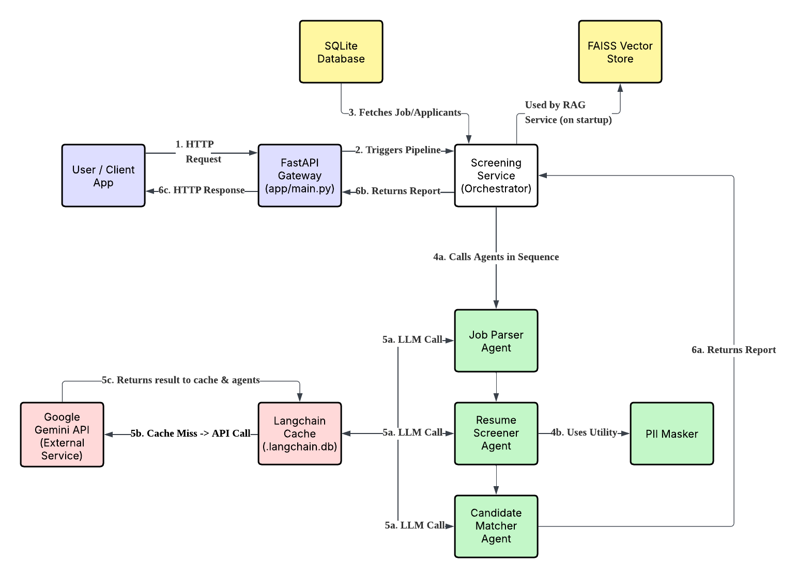

# Agentic HR Screening System API

This project is a sophisticated, agentic AI system designed to automate the initial phases of the HR recruitment process. It uses a multi-agent approach with Large Language Models (LLMs) to parse job descriptions, screen candidate resumes, and provide a ranked shortlist of suitable candidates.



## System Architecture & Workflow

### Component Breakdown
- **User / Client App (Blue):** The entry point for any request. This can be a human user interacting with the API documentation or another automated system.
- **FastAPI Gateway (Blue):** The web server that receives all incoming HTTP requests. It handles API routing, data validation, and response formatting, but delegates the core business logic.
- **Screening Service (Orchestrator):** The central brain of the application. It manages the end-to-end workflow, coordinating between the database and the various AI agents.
- **Data Stores (Yellow):**
  - **SQLite Database:** The primary relational database for storing persistent, structured data like job information and candidate profiles.
  - **FAISS Vector Store:** A specialized database used to store vector embeddings of resumes for efficient similarity searched (used by the RAG Q&A functionality).
- **Agentic Core (Green):** The specialized AI workers that perform specific tasks.
  - **Job Parser, Resumer Screener, Candidate Matcher Agents:** Each agent is an LLM-powered chain responsible for a single, well-defined task.
  - **PII Masker:** A critical utility used by the `Resume Screener` to anonymize data before it is processed by the LLM, ensuring privacy and compliance.
- **Caching & External Services (Red):**
  - **Langchain Cache:** A performance-enhancing layer that intercepts all LLM calls. It stores the results of previous calls to avoid redundant, costly, and time-consuming API requests.
  - **Google Gemini API:** The external Large Language Model that provides the core reasoning and language understanding capabilities for all agents.

## Step-by-Step Workflow

The numbers in the diagram correspond to the following sequence of events for a typical screening request:

1. **HTTP Request:** The process begins when the **User / Client App** sends a `POST` request to a specific endpoint on the **FastAPI Gateway**, for example, `/screen/1`.

2. **Triggers Pipeline:** The Gateway validates the request and calls the **Screening Service (Orchestrator)**, passing along the `job_id`.

3. **Fetches Job/Applicants:** The Orchestrator queries the **SQLite Database** to retrieve the details for the specified job and a list of all candidates who have applied for it.

4. **Calls Agents in Sequence**: The Orchestrator begins the multi-agent workflow:
    - **(4a)** It sequentially invokes the `Job Parser Agent`, `Resume Screener Agent`, and finally the `Candidate Matcher Agent`.
    - **(4b)** During its turn, the `Resume Screener Agent` utilizes the **PII Masker** utility to anonymize the candidate's data before processing.

5. **The "Thinking" Process (LLM Calls):** Each time an agent needs to perform its task, it makes an "LLM Call".
    - **(5a)** The request is first sent to the **LangChain Cache**.
    - If the exact same request has been made before, the cache returns the stored result instantly.
    - If it's a new request (a "cache miss"), the cache forwards the request to the external **Google Gemini API**.
    - **(5c)** The Gemini API returns the result, which is passed back to the agent and stored in the cache for future use.

6. **Returns Report:** The workflow concludes as the final result is passed back up the chain.
    - **(6a)** The `Candidate Matcher Agent` completes its analysis and returns the final `ScreeningReport` to the **Screening Service**.
    - **(6b)** The **Screening Service** returns the completed report to the **FastAPI Gateway**.
    - **(6c)** The **FastAPI Gateway** serializes the report into a JSON format and sends it back to the **User / Client App** as the final **HTTP Response**.

## 🌟 Key Features

- **Multi-Agent Architecture**: Separate agents for parsing, screening, and matching, allowing for specialized and robust logic.
- **Intelligent Parsing**: Uses an LLM (Google Gemini) to extract structured data from unstructured job descriptions and resumes.
- **Ethical by Design**: Implements automatic PII (Personally Identifiable Information) masking to ensure candidate privacy and PDPA/GDPR compliance.
- **Database Integration**: Stores job and candidate data in a relational database (SQLite) using SQLModel.
- **Performance Optimized**: Features a built-in cache to dramatically speed up repeated LLM calls, saving time and cost.
- **API-driven**: The entire system is exposed via a professional FastAPI web server with automated documentation.
- **Containerized**: Packaged with Docker for easy, consistent, and portable deployment.

## 🛠️ Tech Stack

- **Backend**: Python, FastAPI
- **AI/LLM**: LangChain, Google Gemini-2.0-Flash
- **Database**: SQLModel, SQLAlchemy, SQLite
- **DevOps**: Docker, Docker Compose
- **Tooling**: Pydantic, Presidio for PII masking

## 🚀 Getting Started

### Prerequisites

- Python 3.10+
- Docker and Docker Compose
- A Google Gemini API Key

### Installation & Setup

1.  **Clone the repository:**
    ```bash
    git clone https://github.com/YOUR_USERNAME/hr-agentic-ai-project.git
    cd hr-agentic-ai-project
    ```

2.  **Create the environment file:**
    Create a file named `.env` in the project root and add your API key:
    ```
    GOOGLE_API_KEY="your_secret_google_api_key_here"
    ```

3.  **Build and run the application with Docker Compose:**
    This is the recommended method as it handles everything for you.
    ```bash
    docker-compose up --build
    ```

The API will be available at `http://127.0.0.1:8000`.

## Usage

The best way to interact with the API is through the auto-generated documentation.

1.  Navigate to **`http://127.0.0.1:8000/docs`** in your browser.

2.  Use the `POST /screen/{job_id}` endpoint to run the screening pipeline.
    -   Try `job_id: 1` to screen for the "Senior Python Developer" role.
    -   The system will process the applicants from the database and return a ranked JSON report.

### Example Response

```json
{
  "job_title": "Senior Python Developer",
  "ranked_candidates": [
    {
      "candidate_id": "CAND_1",
      "score": 9,
      "justification": "Excellent match. Exceeds experience requirement and possesses all key skills including FastAPI and Docker."
    },
    // ... other candidates
  ]
}